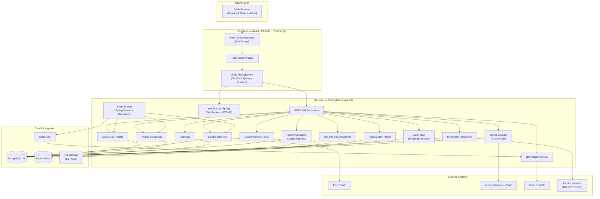
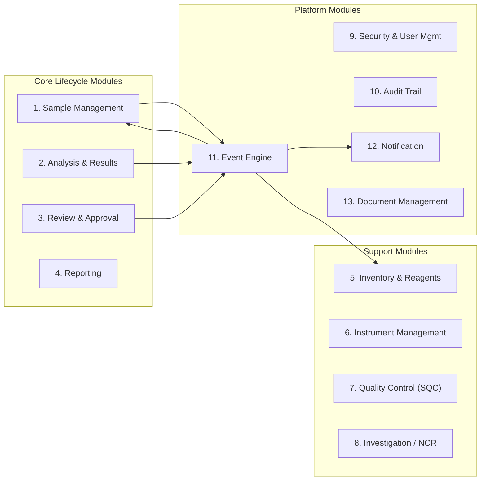
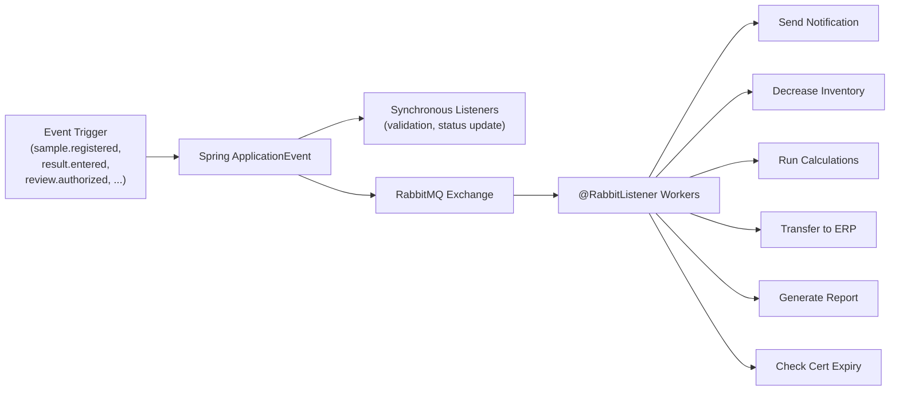
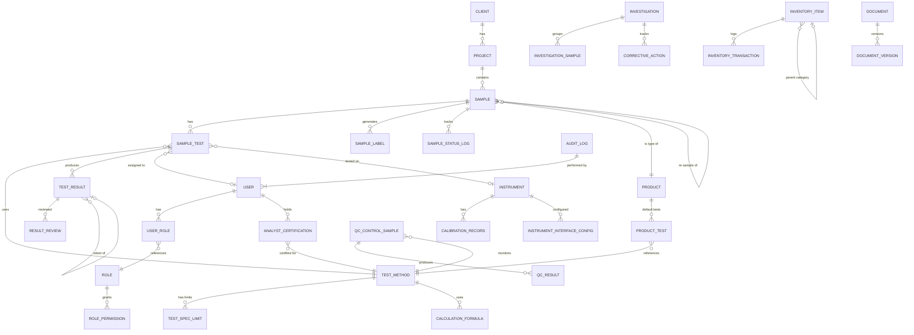
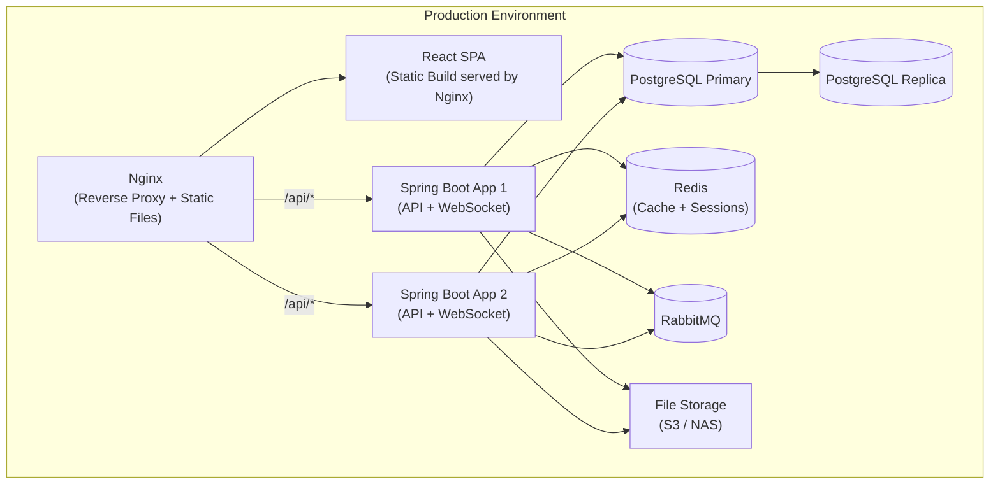

# LIMS — High-Level System Architecture

## 1. System Overview

A web-based Laboratory Information Management System (LIMS) for third-party civil testing laboratories, fully compliant with Saudi Aramco standard **23-SAMSS-070** and **ISO 17025**. The system manages the complete sample lifecycle — from client job booking through testing, review, and certificate generation — with full audit trailing, role-based security, instrument integration, and ERP connectivity.

### 1.1 Architecture Style

**Two-project modular architecture** — a **Spring Boot backend** (REST API) and a **React frontend** (SPA) as separate projects. The backend follows a modular monolith pattern with well-defined internal module boundaries, keeping things simple while allowing extraction into microservices later if scale demands it.



### 1.2 Technology Stack

| Layer | Technology | Rationale |
|---|---|---|
| **Frontend** | **React 18+ (Vite + TypeScript)** | Fast dev builds, industry-standard SPA framework, largest ecosystem |
| **UI Library** | **Ant Design 5** | Enterprise-grade components (tables, forms, dashboards, charts, layouts) |
| **State Management** | **TanStack Query + Zustand** | Server state caching/sync + lightweight client state |
| **Backend** | **Spring Boot 3.2+ (Java 21)** | Enterprise-grade framework, mature security, excellent audit and ERP tooling |
| **ORM** | **Spring Data JPA + Hibernate 6** | Type-safe repositories, Hibernate Envers for audit, mature migrations (Flyway) |
| **Database** | **PostgreSQL 16** | ACID compliance, JSONB for flexible fields, full audit support, encryption |
| **Cache** | **Redis** | Session management, real-time pub/sub |
| **Queue** | **RabbitMQ** | Event-driven workflow execution, scheduled jobs, retries, Spring AMQP integration |
| **Auth** | **Spring Security + LDAP/AD** | Industry-standard RBAC, method-level security, Active Directory integration |
| **Reporting** | **JasperReports + Apache POI** | Template-based PDF certificate generation, Excel report export |
| **Charts/SQC** | **Recharts** (frontend) + **Apache Commons Math** (backend) | Client-side charting + server-side statistical computations |
| **Barcode** | **ZXing** (backend) + **react-barcode** (frontend) | Server-side barcode generation for labels |
| **File Storage** | **S3-compatible / NAS / local disk** | SOPs, MSDS, certificates, manufacturer docs |
| **Real-time** | **Spring WebSocket + STOMP** | Live dashboard updates, status change notifications |
| **API Docs** | **SpringDoc OpenAPI (Swagger)** | Auto-generated API documentation, TypeScript client codegen |
| **DB Migrations** | **Flyway** | Version-controlled database schema migrations |

---

## 2. Backend Architecture — Core Service Modules

Each module is a self-contained service layer with its own REST controllers, service classes, JPA repositories, and DTOs. They communicate via the **Event Engine** (Spring Application Events + RabbitMQ) for cross-cutting workflows.

### Module Map



---

### Module 1: Sample Management *(Req 3.1–3.5)*

**Purpose:** Full sample lifecycle from registration through receipt and work assignment.

| API Endpoint Group | Key Operations |
|---|---|
| `POST /api/samples` | Register single or batch samples; auto-assign IDs and default tests per product |
| `POST /api/samples/schedule` | Create/manage routine sample schedules (per shift, around the clock) |
| `GET /api/samples` | List/filter/search samples with configurable explorer views |
| `PATCH /api/samples/:id/receive` | Record receipt (who, when); trigger label printing |
| `PATCH /api/samples/:id/reject` | Reject sample with reason; trigger email notification |
| `PATCH /api/samples/:id/assign` | Assign sample/tests to technician or lab (auto or manual) |
| `POST /api/samples/:id/labels` | Generate barcode labels (configurable format/layout) |
| `GET /api/samples/:id/chain-of-custody` | Full status history with timestamps |

**Key business rules:**
- Duplicate detection on product + tests + login time
- Pre-log (before collection) and post-log (after collection) support
- Logical linking of related samples
- Auto-status transitions: `Logged → Un-Received → Received → In-Progress → …`
- Turnaround time auto-calculation (receipt → authorization)

---

### Module 2: Analysis & Results *(Req 3.6)*

**Purpose:** Test result entry, instrument data capture, calculations, and validation.

| API Endpoint Group | Key Operations |
|---|---|
| `POST /api/results` | Enter results (quantitative, pass/fail, free text, menu) |
| `POST /api/results/instrument-import` | Auto-import results from instrument interface |
| `GET /api/results/entry-screen/:sampleId` | Render result entry form with specs and limits |
| `POST /api/results/:id/retest` | Create retest instance with justification |
| `POST /api/samples/:id/resample` | Create linked re-sample |
| `POST /api/calculations/formulas` | Define/manage calculation formulas |
| `POST /api/calculations/execute` | Run auto-calculations (intermediate → final, cross-test, cross-sample) |

**Key business rules:**
- Validate against plausibility limits on entry; block if outside
- Warn and flag out-of-range results with color/sign
- Display spec ranges on-screen during entry
- Multiple limit sets per test
- Record instrument ID; block entry if instrument overdue for calibration
- Timestamp + operator auto-recorded with every result

---

### Module 3: Review & Approval *(Req 3.7)*

| API Endpoint Group | Key Operations |
|---|---|
| `PATCH /api/review/:id/authorize` | Authorize result/sample/test (step 1 or step 2) |
| `PATCH /api/review/:id/reject` | Reject with comment |
| `PATCH /api/review/:id/reactivate` | Reactivate (privileged users only) |
| `GET /api/review/queue` | Get items awaiting review (with exception-based filtering) |
| `GET /api/review/out-of-range` | Separately list flagged results |

**Key business rules:**
- Two-step approval process (configurable per test/product)
- Review by exception: auto-pass results within spec
- Lock all fields after authorization/rejection
- Track every change with reason for correction
- SOPs and MSDS viewable as hyperlinks during review

---

### Module 4: Reporting *(Req 3.8)*

| API Endpoint Group | Key Operations |
|---|---|
| `POST /api/reports/generate` | Generate report (PDF, HTML, Excel) |
| `POST /api/reports/schedule` | Schedule recurring report execution |
| `GET /api/reports/templates` | List available report templates |
| `POST /api/reports/certificate/:sampleId` | Generate Certificate of Analysis |

**Built-in report types:** Certificate of Analysis, turnaround time, technician productivity, overdue samples, workload, reagent consumption, calibration records, QC reports, control charts, statistical method performance.

**Delivery:** Interactive view, print, email, PDF export, HTML, scheduled execution.

---

### Module 5: Inventory & Reagents *(Req 3.11, 4.6)*

| API Endpoint Group | Key Operations |
|---|---|
| `CRUD /api/inventory` | Manage stock items (reagents, chemicals, instrument parts, retention samples) |
| `PATCH /api/inventory/:id/consume` | Decrease quantity (auto-triggered by testing events) |
| `GET /api/inventory/expiring` | Items expiring within configurable window |
| `GET /api/inventory/reorder` | Items below reorder quantity |
| `POST /api/inventory/:id/barcode-scan` | Update inventory via barcode scanning |

**Fields tracked:** Type, catalog number, chemical name, location, quantity, stock units, expiration, reorder quantity, supplier info, MSDS attachment.

---

### Module 6: Instrument Management *(Req 4.3, 4.9)*

| API Endpoint Group | Key Operations |
|---|---|
| `CRUD /api/instruments` | Register and manage lab instruments |
| `POST /api/instruments/:id/calibration` | Record calibration event |
| `GET /api/instruments/overdue` | Instruments overdue for calibration/maintenance |
| `POST /api/instruments/:id/interface-config` | Configure data mapping templates (RS-232, TCP/IP, file) |
| `GET /api/instruments/:id/sqc-chart` | Generate SQC chart for instrument performance |

**Key business rules:**
- Block result entry if instrument overdue for service
- Scheduled calibration/maintenance alerts (configurable X days)

---

### Module 7: Quality Control / SQC *(Req 4.10)*

| API Endpoint Group | Key Operations |
|---|---|
| `POST /api/qc/control-samples` | Log QC control samples |
| `GET /api/qc/charts/:testMethodId` | Generate control charts (X-bar, range, Pareto, histogram, scatter) |
| `POST /api/qc/limits` | Define QC ranges from control chart analysis |
| `GET /api/qc/statistics` | Statistical routines (std dev, method performance evaluation) |

---

### Module 8: Investigation / Non-Conformance *(Req 4.8)*

| API Endpoint Group | Key Operations |
|---|---|
| `CRUD /api/investigations` | Create and manage non-conformance reports |
| `POST /api/investigations/:id/corrective-action` | Record corrective actions and root cause analysis |
| `PATCH /api/investigations/:id/approve` | Approval workflow for investigation closure |

---

### Module 9: Security & User Management *(Req 4.2)*

| API Endpoint Group | Key Operations |
|---|---|
| `POST /api/auth/login` | Authenticate via AD/LDAP or local credentials |
| `CRUD /api/users` | User profile management (central registration) |
| `CRUD /api/roles` | Role definitions with granular permissions |
| `POST /api/users/:id/lock` | Auto-lock after max login failures |
| `GET /api/users/session-config` | Per-user session timeout settings |

**RBAC restrictions by:** Location, authority type (read/write/delete), function, workflow. Custom menus per user or group.

---

### Module 10: Audit Trail *(Req 3.9)*

- **Hibernate Envers** — automatic, annotation-based entity auditing (`@Audited` on entities)
- Envers creates `_AUD` shadow tables automatically for every audited entity
- Records: `userId`, `timestamp`, `revisionType` (ADD/MOD/DEL), full before/after entity snapshots
- Custom `RevisionEntity` captures additional metadata (IP address, reason for change)
- **AES-256 encrypted** sensitive field values at rest via `@ColumnTransformer` or AttributeConverter
- Audit tables are **append-only** (no UPDATE/DELETE permissions via DB-level grants)
- Viewable/reportable only by authorized lab users via dedicated REST endpoint with Spring Security

---

### Module 11: Event Engine *(Req 2)*

The **central nervous system** of the LIMS. Built on **Spring Application Events** (in-process) + **RabbitMQ** (async/durable) to trigger automated workflows.



- Synchronous listeners handle immediate in-transaction work (status updates, validation)
- Async RabbitMQ listeners handle fire-and-forget work (email, ERP, reports)
- **Spring Scheduler** (`@Scheduled`) for cron-based recurring tasks (calibration alerts, scheduled reports)
- **Configurable event → action mappings** stored in the database so authorized users can customize workflow behavior without code changes

---

### Module 12: Notification Service *(Req 3.8.7)*

| Channel | Use Cases |
|---|---|
| **Email (SMTP)** | Sample collection alerts, rejection notices, out-of-spec notifications, certificate delivery, calibration reminders, inventory reorder alerts |
| **In-App** | Real-time dashboard notifications via WebSocket |

---

### Module 13: Document Management *(Req 4.5)*

| API Endpoint Group | Key Operations |
|---|---|
| `CRUD /api/documents` | Upload, version, and manage lab documents (SOPs, MSDS, methods) |
| `POST /api/documents/:id/approve` | Document approval workflow |
| `GET /api/documents/revision-due` | Documents due for revision |
| `GET /api/documents/:id/versions` | Version history with full access control |

---

## 3. Frontend Architecture (React SPA)

### 3.1 Project Structure

```
lims-frontend/                         # Vite + React + TypeScript
├── src/
│   ├── api/                           # Auto-generated API client (from OpenAPI spec)
│   │   └── generated/                 # TypeScript types + fetch functions
│   ├── pages/                         # Route-level page components
│   │   ├── dashboard/                 # Main dashboard
│   │   ├── samples/                   # Sample lifecycle pages
│   │   │   ├── RegisterPage.tsx
│   │   │   ├── ReceivePage.tsx
│   │   │   ├── SampleDetailPage.tsx
│   │   │   └── SchedulePage.tsx
│   │   ├── analysis/                  # Result entry & testing
│   │   │   ├── ResultEntryPage.tsx
│   │   │   ├── RetestPage.tsx
│   │   │   └── FormulaBuilderPage.tsx
│   │   ├── review/                    # Review & approval queue
│   │   ├── reports/                   # Report generation & viewing
│   │   ├── instruments/               # Instrument management
│   │   ├── inventory/                 # Reagents & materials
│   │   ├── qc/                        # SQC charts & control
│   │   ├── investigations/            # Non-conformance reports
│   │   ├── documents/                 # Document management
│   │   ├── admin/                     # System administration
│   │   │   ├── UsersPage.tsx
│   │   │   ├── RolesPage.tsx
│   │   │   ├── ConfigPage.tsx
│   │   │   └── AuditTrailPage.tsx
│   │   ├── settings/                  # Personal settings
│   │   └── LoginPage.tsx
│   ├── components/                    # Shared UI components
│   │   ├── layout/                    # AppShell, Sidebar, Header
│   │   ├── data-table/                # Configurable Ant Design tables
│   │   ├── forms/                     # Form components (Ant Design Form)
│   │   ├── charts/                    # SQC & analytics (Recharts)
│   │   ├── barcode/                   # Label & barcode rendering
│   │   └── common/                    # Buttons, modals, alerts
│   ├── hooks/                         # Custom React hooks
│   ├── store/                         # Zustand stores (auth, UI state)
│   ├── utils/                         # Utilities, formatters, validators
│   ├── routes.tsx                     # React Router route definitions
│   ├── App.tsx                        # Root app component
│   └── main.tsx                       # Entry point
├── public/
├── package.json
├── tsconfig.json
└── vite.config.ts
```

### 3.2 Key Technical Decisions

| Concern | Approach |
|---|---|
| **API Client** | Auto-generated from Spring Boot OpenAPI spec using **openapi-typescript-codegen**. Ensures frontend ↔ backend types stay in sync |
| **Server State** | **TanStack Query (React Query)** — caching, background refetch, optimistic updates, pagination |
| **Client State** | **Zustand** — lightweight store for auth context, UI preferences, sidebar config |
| **Routing** | **React Router v6** — protected routes via auth guards, lazy-loaded route modules |
| **Forms** | **Ant Design Form** — built-in validation, dynamic field rendering for different result types |
| **Real-time** | **STOMP over WebSocket** (via `@stomp/stompjs`) — subscribing to backend topics for live updates |

### 3.3 Key UI Modules

| Module | Key Screens | Req Reference |
|---|---|---|
| **Dashboard** | Configurable widgets: un-received samples, in-progress, awaiting auth, today's authorized, overdue alerts | 4.1 |
| **Sample Registration** | Job booking form (mirrors Document 2), batch registration, schedule builder | 3.1 |
| **Sample Receipt** | Barcode scan to receive, reject with reason dialog, label printing | 3.3, 3.4 |
| **Result Entry** | Dynamic form per test type (quantitative/pass-fail/text/menu), spec ranges shown, color-coded validation | 3.6 |
| **Review Queue** | Filterable list, multi-select authorize/reject, out-of-range separate tab, two-step approval | 3.7 |
| **Report Center** | Template picker, schedule builder, on-demand generation, preview, email delivery | 3.8 |
| **Instrument Console** | Instrument registry, calibration schedule, data mapping config, SQC charts | 4.3, 4.9 |
| **Inventory** | Stock management, barcode scanning, expiry alerts, reorder dashboard | 3.11, 4.6 |
| **SQC Charts** | Interactive control charts, X-bar, range, Pareto, histograms with drill-down | 4.10 |
| **Admin Panel** | User/role management, AD integration config, system settings, audit viewer | 4.2, 3.9 |

### 3.4 Responsiveness & Access

- **Desktop-first** with responsive breakpoints for tablet and mobile (Ant Design Grid system)
- **Configurable dashboards** per user role (react-grid-layout for drag-and-drop widgets)
- **Auto-refresh** via TanStack Query `refetchInterval` + WebSocket push for critical updates
- **Custom sidebar menus** per user/role (admin-configurable, fetched from backend on login)

---

## 4. Database Design

### 4.1 Entity-Relationship Diagram



### 4.2 Core Tables — Schema Overview

#### Client & Project

| Table | Key Columns | Purpose |
|---|---|---|
| `client` | id, name, post_box, contact_person, tel_fax, email, address | Client registry (from Job Booking Form) |
| `project` | id, client_id, project_no, project_name, consultant, owner, contractor, location | Project registry |

#### Sample Lifecycle

| Table | Key Columns | Purpose |
|---|---|---|
| `sample` | id, sample_number (auto), customer_sample_id, project_id, product_id, status, priority, description, source, sampled_by, sample_from, sample_certificate_no, delivered_by, date_received, po_rv_quotation_no, logged_by, logged_at, received_by, received_at, rejection_reason, parent_sample_id (self-ref for re-sample), schedule_id | Core sample record |
| `sample_status_log` | id, sample_id, status, changed_by, changed_at, notes | Chain of custody / status history |
| `sample_label` | id, sample_id, barcode_data, label_format, printer_id, printed_at | Barcode label tracking |
| `sample_schedule` | id, product_id, sample_point, frequency, shift_pattern, next_due_at, is_active | Routine sample scheduling |

#### Testing & Results

| Table | Key Columns | Purpose |
|---|---|---|
| `product` | id, name, code, description, specification_id | Product/material definitions |
| `test_method` | id, name, code, description, result_type (quantitative/passfail/freetext/menu), sop_link, msds_link, unit_of_measure | Test method definitions |
| `test_spec_limit` | id, test_method_id, product_id, limit_set_name, lower_plausibility, lower_warning, lower_spec, upper_spec, upper_warning, upper_plausibility | Multiple limit sets per test |
| `product_test` | id, product_id, test_method_id, is_default, sort_order | Default test list per product |
| `sample_test` | id, sample_id, test_method_id, assigned_to, instrument_id, status, is_retest, retest_of_id, retest_justification | Tests assigned to a sample |
| `test_result` | id, sample_test_id, result_value, result_text, result_menu_option, entered_by, entered_at, is_out_of_range, flag_color, instrument_id, is_auto_imported | Individual result records |
| `calculation_formula` | id, test_method_id, name, formula_expression, input_fields, is_cross_sample | Formula definitions |
| `menu_option` | id, test_method_id, option_value, sort_order | Predefined menu choices for menu-type tests |

#### Review & Approval

| Table | Key Columns | Purpose |
|---|---|---|
| `result_review` | id, test_result_id, review_step (1 or 2), action (authorize/reject/reactivate), reviewer_id, reviewed_at, comment, is_auto_approved | Review records |

#### Instruments & Calibration

| Table | Key Columns | Purpose |
|---|---|---|
| `instrument` | id, name, model, serial_number, location, status, last_calibrated_at, next_calibration_due, calibration_frequency_days | Instrument registry |
| `calibration_record` | id, instrument_id, calibrated_by, calibrated_at, result, notes, certificate_file_id | Calibration history |
| `instrument_interface_config` | id, instrument_id, connection_type (RS232/TCP_IP/FILE), config_json, data_mapping_template_id | Interface configuration |

#### Inventory & Reagents

| Table | Key Columns | Purpose |
|---|---|---|
| `inventory_item` | id, type (reagent/chemical/part/retention_sample), catalog_number, chemical_name, location, quantity, stock_units, expiration_date, reorder_quantity, supplier_info, msds_file_id, shelf_location, status (active/inactive), retention_period_days | Stock item master |
| `inventory_transaction` | id, item_id, transaction_type (receive/consume/adjust/discard), quantity_change, performed_by, performed_at, sample_test_id | Inventory movement log |

#### Users & Security

| Table | Key Columns | Purpose |
|---|---|---|
| `user` | id, username, email, display_name, password_hash, ad_distinguished_name, is_active, is_locked, failed_login_count, max_failures, session_timeout_minutes, location_id | User accounts |
| `role` | id, name, description, custom_menu_config (JSON) | Role definitions |
| `user_role` | id, user_id, role_id | User-role assignments |
| `role_permission` | id, role_id, module, action (read/write/delete), scope_type (location/function/workflow), scope_value | Granular permissions |
| `analyst_certification` | id, user_id, test_method_id, instrument_id, certified_date, expiry_date, certificate_doc_id | Analyst training records |

#### Quality Control

| Table | Key Columns | Purpose |
|---|---|---|
| `qc_control_sample` | id, test_method_id, sample_id, batch_reference | QC sample tracking |
| `qc_result` | id, qc_sample_id, result_value, entered_at | QC result data |
| `qc_limit` | id, test_method_id, chart_type, target_value, ucl, lcl, usl, lsl | Control chart limits |

#### Investigation & Non-Conformance

| Table | Key Columns | Purpose |
|---|---|---|
| `investigation` | id, title, description, status, created_by, created_at, template_id | NCR header |
| `investigation_sample` | id, investigation_id, sample_id | Linked samples |
| `corrective_action` | id, investigation_id, description, root_cause, action_plan, responsible_user_id, due_date, status, approved_by, approved_at | CAPA records |

#### Documents & Audit

| Table | Key Columns | Purpose |
|---|---|---|
| `document` | id, title, type (SOP/MSDS/METHOD/CERTIFICATE), current_version_id, status, access_control_json | Document registry |
| `document_version` | id, document_id, version_number, file_path, uploaded_by, uploaded_at, approved_by, approved_at, notes | Version tracking |
| `audit_log` | id, user_id, timestamp, table_name, record_id, field_name, old_value_encrypted, new_value_encrypted, action (INSERT/UPDATE/DELETE), ip_address | **Immutable, encrypted** audit trail |

#### Event Engine

| Table | Key Columns | Purpose |
|---|---|---|
| `event_config` | id, event_type, action_type, action_config (JSON), is_active, created_by | Configurable event → action mappings |
| `event_log` | id, event_type, payload_json, status (pending/processing/completed/failed), created_at, completed_at | Event execution history |

---

## 5. Cross-Cutting Concerns

### 5.1 Audit Trail Implementation
- **Hibernate Envers** auto-creates `_AUD` shadow tables for all `@Audited` entities
- Custom `RevisionEntity` captures userId, IP address, timestamp, and optional change reason
- Sensitive field values **AES-256 encrypted** via JPA `AttributeConverter`
- Audit tables are **append-only** (database-level REVOKE on UPDATE/DELETE)
- Admin UI provides search, filter, and export of audit records via `/api/audit` endpoints

### 5.2 Event-Driven Workflow Engine
- Services publish `ApplicationEvent` subclasses (e.g., `SampleRegisteredEvent`, `ResultEnteredEvent`)
- **Synchronous `@EventListener`** methods handle in-transaction work (status updates, validation)
- **`@Async` listeners** and **RabbitMQ `@RabbitListener`** workers handle async work (email, ERP, reports)
- **`@Scheduled`** methods handle cron-based recurring tasks (calibration alerts, scheduled reports, inventory expiry checks)
- Event → action mappings stored in database and **configurable by authorized users** via admin UI

### 5.3 ERP Integration (Req 4.4)
- **Outbound:** Result data pushed to ERP/SAP via REST API, XML, or OPC on result authorization
- **Inbound:** Work orders / sample requests pulled from ERP via scheduled polling or webhooks
- **Spring Integration** adapter pattern allows swapping ERP connectors without core changes
- SAP connectivity via **SAP JCo** (Java Connector) for direct RFC/BAPI calls if needed

### 5.4 Barcode & Label Printing
- **ZXing** library generates barcode images server-side (Code 128, QR, etc.)
- Labels rendered via **JasperReports** label templates → PDF for printing
- Configurable label formats/sizes per label type and printer location

### 5.5 Instrument Data Capture
- **Dedicated integration service** (can be a separate Spring Boot module or standalone app)
- **jSerialComm** for RS-232 serial communication, **Netty** for TCP/IP instrument connections
- File watchers via Java NIO `WatchService` monitor drop folders for instrument output files
- Data mapped to LIMS fields via configurable templates stored in `instrument_interface_config`

### 5.6 API Documentation & Frontend Sync
- **SpringDoc OpenAPI** auto-generates Swagger UI and OpenAPI 3.0 JSON spec from controllers
- Frontend API client **auto-generated** from the spec — ensures type safety across the stack
- Breaking API changes caught at build time via TypeScript compilation

---

## 6. Deployment Architecture



- **Nginx** serves the React static build and reverse-proxies `/api/*` requests to Spring Boot instances
- **Spring Boot** instances are stateless (sessions in Redis) — scale horizontally behind Nginx
- **RabbitMQ** handles async event processing — event listeners run inside the same Spring Boot JVM
- **Scalability path:** Start with a single server (Nginx + 1 Spring Boot + PostgreSQL + RabbitMQ + Redis). Scale by adding more Spring Boot instances behind Nginx.

---

## 7. Requirements Traceability Matrix

| Requirement Section | Backend Module | Frontend Module | DB Tables |
|---|---|---|---|
| 3.1 Sample Registration | Sample Management | Sample Registration | sample, sample_schedule, product, product_test |
| 3.2 Sample Identification | Sample Management | Sample Registration | sample, sample_label |
| 3.3 Sample Collection | Sample Management, Notification | Sample Receipt | sample, sample_label |
| 3.4 Sample Receipt | Sample Management | Sample Receipt | sample, sample_status_log |
| 3.5 Work Assignment | Sample Management | Sample Detail | sample_test |
| 3.6 Analysis | Analysis & Results | Result Entry | sample_test, test_result, calculation_formula |
| 3.7 Analysis Review | Review & Approval | Review Queue | result_review |
| 3.8 Reports | Reporting | Report Center | (reads from all tables) |
| 3.9 Audit Trailing | Audit Trail | Admin › Audit | audit_log |
| 3.10 Statuses | Sample Management, Event Engine | Dashboard, Sample Detail | sample_status_log |
| 3.11 Standards & Reagents | Inventory | Inventory | inventory_item, inventory_transaction |
| 4.1 User Interface | — | All modules | — |
| 4.2 User Security | Security & User Mgmt | Admin › Users | user, role, role_permission |
| 4.3 Instrument Interface | Instrument Management | Instrument Console | instrument, instrument_interface_config |
| 4.4 ERP Integration | Event Engine (ERP adapter) | Admin › Integration | event_config |
| 4.5 Document Management | Document Management | Documents | document, document_version |
| 4.6 Material Inventory | Inventory | Inventory | inventory_item, inventory_transaction |
| 4.7 Analyst Certification | Security & User Mgmt | Admin › Users | analyst_certification |
| 4.8 Investigation / NCR | Investigation | Investigations | investigation, corrective_action |
| 4.9 Calibration & QC | Instrument Management | Instrument Console | calibration_record |
| 4.10 SQC | Quality Control | SQC Charts | qc_control_sample, qc_result, qc_limit |

---

## 8. Backend Project Structure (Spring Boot)

```
lims-backend/
├── src/main/java/com/lims/
│   ├── LimsApplication.java                     # Spring Boot entry point
│   ├── config/                                   # Configuration classes
│   │   ├── SecurityConfig.java                   # Spring Security + LDAP
│   │   ├── WebSocketConfig.java                  # STOMP WebSocket config
│   │   ├── RabbitMQConfig.java                   # RabbitMQ exchanges/queues
│   │   ├── OpenApiConfig.java                    # Swagger/OpenAPI config
│   │   └── AuditConfig.java                      # Envers + RevisionEntity
│   ├── module/                                   # Feature modules
│   │   ├── sample/                               # Module 1: Sample Management
│   │   │   ├── controller/SampleController.java
│   │   │   ├── service/SampleService.java
│   │   │   ├── repository/SampleRepository.java
│   │   │   ├── entity/Sample.java
│   │   │   ├── dto/SampleDTO.java
│   │   │   └── event/SampleRegisteredEvent.java
│   │   ├── analysis/                             # Module 2: Analysis & Results
│   │   ├── review/                               # Module 3: Review & Approval
│   │   ├── report/                               # Module 4: Reporting
│   │   ├── inventory/                            # Module 5: Inventory
│   │   ├── instrument/                           # Module 6: Instruments
│   │   ├── qc/                                   # Module 7: Quality Control
│   │   ├── investigation/                        # Module 8: NCR
│   │   ├── security/                             # Module 9: Security & Users
│   │   ├── audit/                                # Module 10: Audit Trail
│   │   ├── event/                                # Module 11: Event Engine
│   │   ├── notification/                         # Module 12: Notifications
│   │   └── document/                             # Module 13: Documents
│   └── common/                                   # Shared utilities
│       ├── entity/BaseEntity.java                # id, createdAt, updatedAt
│       ├── exception/GlobalExceptionHandler.java
│       └── util/
├── src/main/resources/
│   ├── application.yml                           # Main config
│   ├── application-dev.yml                       # Dev profile
│   ├── application-prod.yml                      # Prod profile
│   ├── db/migration/                             # Flyway SQL migrations
│   └── reports/                                  # JasperReports .jrxml templates
├── pom.xml                                       # Maven build
└── Dockerfile
```
